### 0x00 Introduction

> 区块链就像黑匣子一样是完全封闭的，无法与外部世界连通，智能合约本身也无法连接链下数据。对于现实世界中的例如：天气，比赛分数以及航班信息等都无法获取，这也是智能合约最大的痛点，极大程度上限制了智能合约开发者的创造力，那么有什么办法可以解决吗？
>
> 答：当然是有的，预言机则充当这类角色，负责上传现实世界中的真实数据到智能合约。
>
> **预言机分为中心化预言机和去中心化预言机。**
>
> **工作流程**
>
> 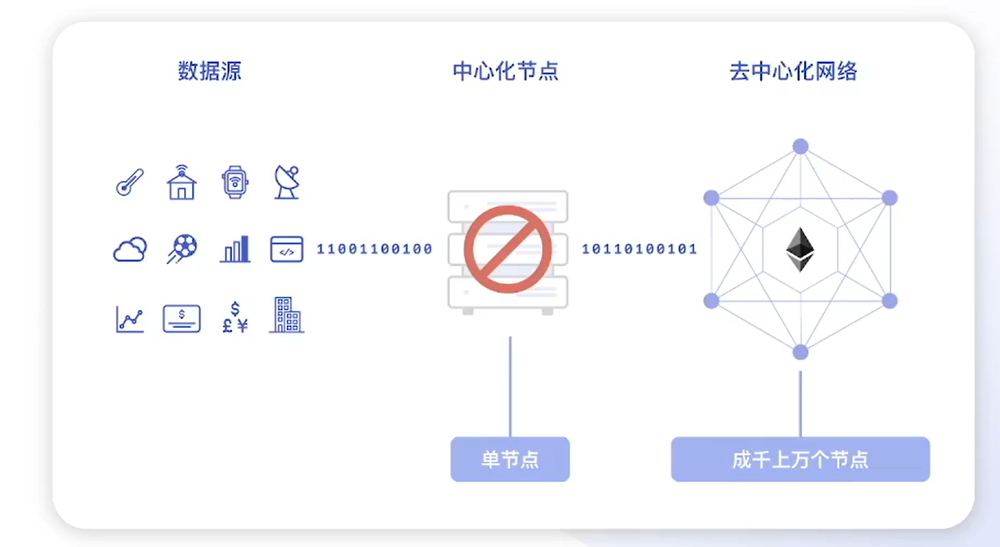
>
> ***中心化预言机***
>
> 负责上传现实世界的真实数据到智能合约的一个数据源，但是由于中心化的缘故，中心化预言机中不仅存在单点失败风险，而且还存在数据不安全风险，这又变相削弱了智能合约安全性的特性。
>
> ***去中心化预言机***
>
> 多个数据节点形成去中心预言机，每个节点都会收集数据，达成共识后输入到区块链的智能合约。而`chainlink`便是其中的一种。
>
> - 技术上：避免了单点失败风险。
> - 数据上：通过网络对多个数据源进行验证。
>
> `chainlink`提供了Data Feed，VRF，Automation 等功能，目前采用的共识机制是取中位数。

### 0x01 Data Feed

#### Principle

**业务流程**

- 数据提供商：负责收集价格数据，将价格数据提供给预言机。
- 预言机节点：获得数据之后和预言机中的其他节点达成共识，随后将共识后的数据发送到`chainlink`部署到区块链中的智能合约，最后用户可以通过部署在区块链的智能合约获取到相应的价格数据。


**技术架构**

采用代理模式，便于合约的升级。

使用流程如下：

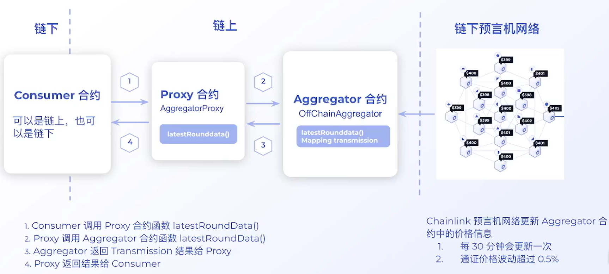

**应用案例**


#### Reproduction

**Tools:** Foundry

**Env：** Sepolia

**Data Source:** https://docs.chain.link/data-feeds/price-feeds/addresses

**Step:**

- step1: 初始化项目

```shell
forge init
```

-  step2：拉取相关库

```shell
forge install https://github.com/smartcontractkit/chainlink --no-commit
```

- step3: 修改配置文件[create remappings]：write=> @chainlink/contracts=lib/chainlink/contracts
- step4: write smart contracts，查询当前比特币的价格

查询合约：

````solidity
// SPDX-License-Identifier: MIT
pragma solidity ^0.8.20;

import "@chainlink/contracts/src/v0.8/shared/interfaces/AggregatorV3Interface.sol";

contract PriceFeed {
    AggregatorV3Interface priceFeed;

    constructor() {
        priceFeed = AggregatorV3Interface(
            0x1b44F3514812d835EB1BDB0acB33d3fA3351Ee43
        );
    }

    function getPrice() public view returns (int256 price) {
        (, price, , , ) = priceFeed.latestRoundData();
    }
}

````

部署合约：

```solidity
// SPDX-License-Identifier: MIT
pragma solidity ^0.8.20;

import {Script} from "forge-std/Script.sol";
import {PriceFeed} from "../src/DataFeed.sol";

contract DeployDataFeed is Script {
    function run() external returns(PriceFeed priceFeed) {
        vm.startBroadcast();
        priceFeed = new PriceFeed();
        vm.stopBroadcast();
    }
}
```

执行查询操作：

```shell
cast to-dec $(cast call 0x9AC6521008b6Cf909b0360db0B6819bBa895D559 "getPrice()" --rpc-url $env:s_rpc --private-key $env:s_pk)
```

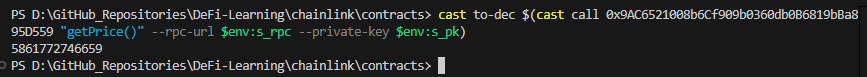

#### Effect

可以有效减少依赖单一数据源的风险，从而降低了价格被操作的可能性。

举个例子，假如某个项目的代币价格依赖于某个 `dex`，hacker可以通过闪电贷的功能，大幅度操纵`dex`的价格，达到操纵项目的代币价格，从而完成一系列的恶意操作。

### 0x02 VRF

#### Principle

**链上方案：**


区块哈希在某种程度上容易被控制，因为区块中包含的内容是交易，交易哈希则是由这些交易所决定的，如果矿工是作恶节点，ta可以通过选择某些特定的交易进行打包，从而控制生成的随机数，进而达到操控随机数的目的。所以这种方式不可行，该作恶方式也被称为`MEV`。

**链下方案：**

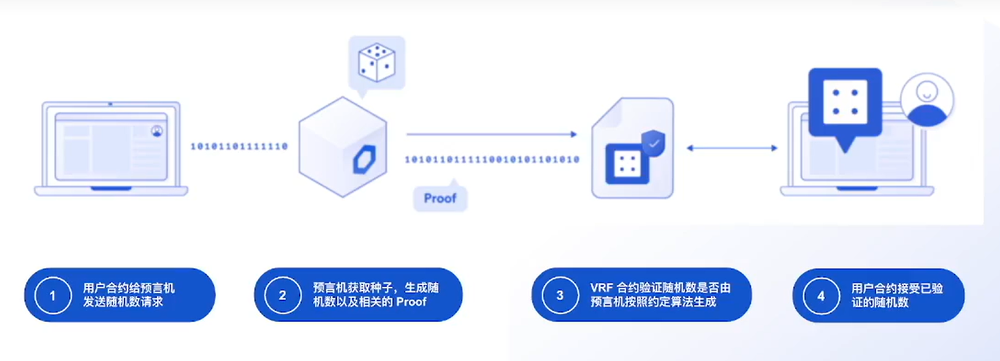

随机数由链下的预言机生成，且不完全取决于区块哈希，同时预言机的私钥也参与运算。

- 对于链上的矿工而言，尽管可以操控区块hash，但是也无法提前算出预言机的随机数。
- 对于链下的预言机而言，尽管可以通过区块hash算出随机数，但是区块哈希对ta来说是一个不可预知的事物。

为了防止伪造随机数，chainlink预言机提供了可以验证的随机数。验证要点：

- 随机数是否通过约定算法生成。
- 用于生成随机数的种子是否为当时的区块哈希。

**可验证随机数(VRF)的特点：**

- 可证明性
- 独特性
- 伪随机性

```js
// VRF 是由3个函数组成
// 1. 密钥生成函数 
G(r) => (PK, SK)
PK: public key
SK: secret key

// 2. 随机数生成函数
E(SK, seed) => (Randomness, Proof)
seed: RNC的种子
Randomness: 随机数
Proof: 证明

// 3. 验证函数
V(PK, seed, Randomness, Proof) => (Trus or False)
True:  验证成功
False: 验证失败
```

**业务流程**

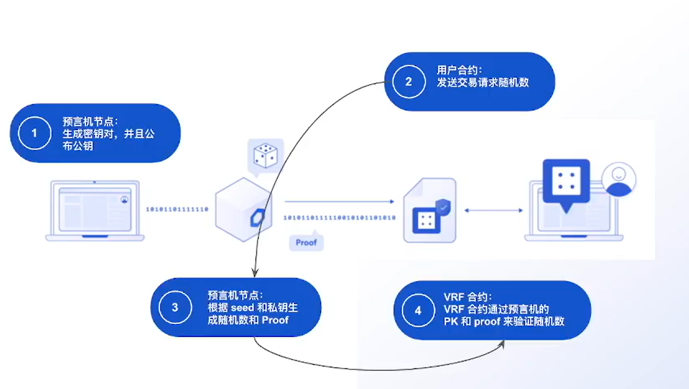

1. 预言机节点：生成密钥对，并且将公钥公开；
2. 用户合约：发送交易请求随机数；
3. 预言机节点：根据seed和私钥生成随机数和 proof；
4. VRF合约：VRF合约通过预言机的PK和proof来验证随机数。

**技术架构**


1. 调用Consumer合约的函数请求随机数；
2. 用户合约调用Coordinator合约的函数请求随机数；
3. 将PreSeed写入Event log；
4. 预言机读取 Event log 中的 PreSeed 和 Blockhash；
5. 预言机通过 VRF 生成随机数和Proof；
6. 预言机将 rc 和 proof 写入 Coordinator；
7. Coordinator 进行验证 并且将随机数写入 Consumer 合约。

**VRF使用场景**

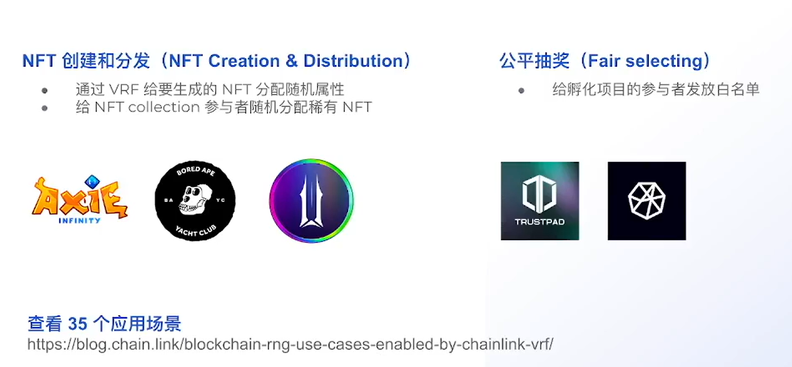

#### Reproduction

**Purpose：**

```solidity
/**
	1. register VRF subscription
	2. add consumer into subscription
	3. consumer -> request random number
	4. consumer <- receive random number
*/
```

**Tools:** Foundry

**Env：** Sepolia

**Data Source:** 

- create subscription:  https://vrf.chain.link/
- VRF Coordinator: https://docs.chain.link/vrf/v2-5/supported-networks

**Step:** 

- step1

    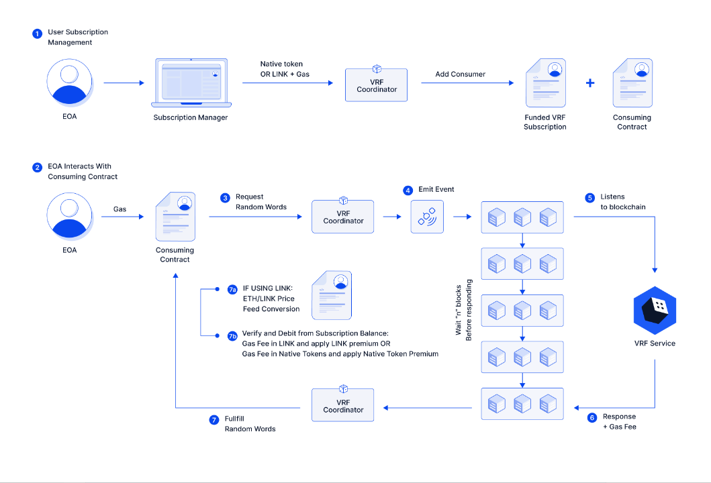

    - 创建订阅号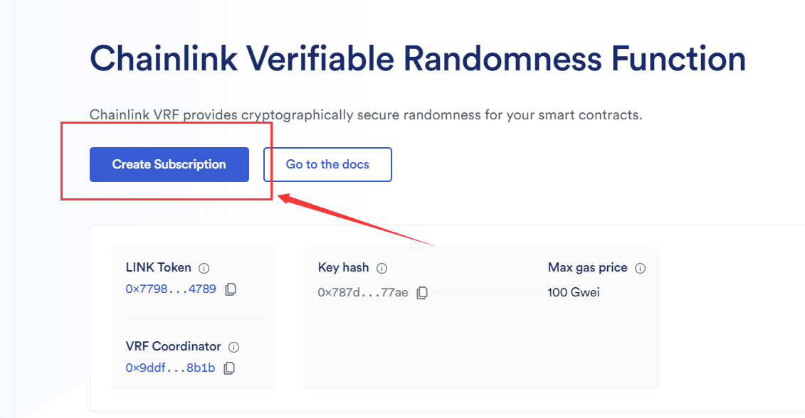

    - 添加 Link Token

        

    - 添加用户consumers

        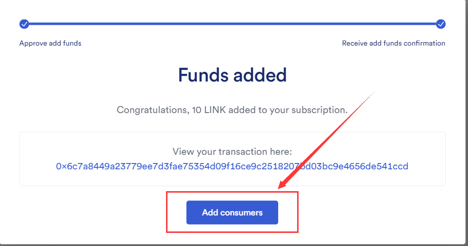

    - 可以看到 Subscription Id【v2.5 已更新为uint256类型】。

- step2：订阅信息

    - PK Hash：不同价格的公钥哈希时效性不同，价格越高，一般响应速度越快。
    - Confirmation 数：表示多少个区块之后这笔交易才算成功。
    - numWords：申请随机数的个数，目前最多为500个。

    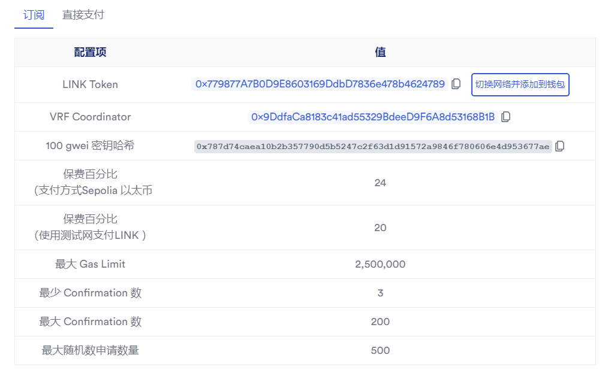
    
- step3：合约编写

    - 部署合约

    ```solidity
    // SPDX-License-Identifier: MIT
    pragma solidity ^0.8.20;
    
    import {Script} from "forge-std/Script.sol";
    import {ChainlinkVRF} from "../src/ChainlinkVRF.sol";
    
    contract DeployChainlinkVRF is Script {
        function run() external returns(ChainlinkVRF chainlinkVRF) {
            vm.startBroadcast();
            chainlinkVRF = new ChainlinkVRF();
            vm.stopBroadcast();
        }
    }
    ```

    - 获取随机数合约

    ```solidity
    // SPDX-License-Identifier: MIT
    pragma solidity ^0.8.20;
    
    import {IVRFCoordinatorV2Plus, VRFV2PlusClient} from "@chainlink/contracts/src/v0.8/vrf/dev/interfaces/IVRFCoordinatorV2Plus.sol";
    import {VRFConsumerBaseV2Plus} from "@chainlink/contracts/src/v0.8/vrf/dev/VRFConsumerBaseV2Plus.sol";
    
    // contract address : 0xD12546C3f4777fe85Cbb9101e4FC3a8e2D0D84fD
    contract ChainlinkVRF is VRFConsumerBaseV2Plus {
    
        IVRFCoordinatorV2Plus COORDINATOR;
        address vrfCoordinatorAddr = 0x9DdfaCa8183c41ad55329BdeeD9F6A8d53168B1B;
        uint256[] public s_randomWords;
    
        constructor() VRFConsumerBaseV2Plus(vrfCoordinatorAddr) {
            COORDINATOR = IVRFCoordinatorV2Plus(vrfCoordinatorAddr);
        }
    
        function requestRandomWrods(
            bytes32 keyHash,
            uint256 subId,
            uint16 requestConfirmations,
            uint32 callbackGasLimit,
            uint32 numWords
        ) external onlyOwnerOrCoordinator returns (uint256 requestId) {
            VRFV2PlusClient.RandomWordsRequest memory request = VRFV2PlusClient
                .RandomWordsRequest(
                    keyHash,
                    subId,
                    requestConfirmations,
                    callbackGasLimit,
                    numWords,
                    ""
                );
            requestId = COORDINATOR.requestRandomWords(request);
        }
    
        function fulfillRandomWords(
            uint256,
            uint256[] calldata randomWords
        ) internal override {
            s_randomWords = randomWords;
        }
    
        function getRandomWrods() external view returns (uint256[] memory) {
            return s_randomWords;
        }
    }
    ```

- step4：将部署的地址添加到官网

    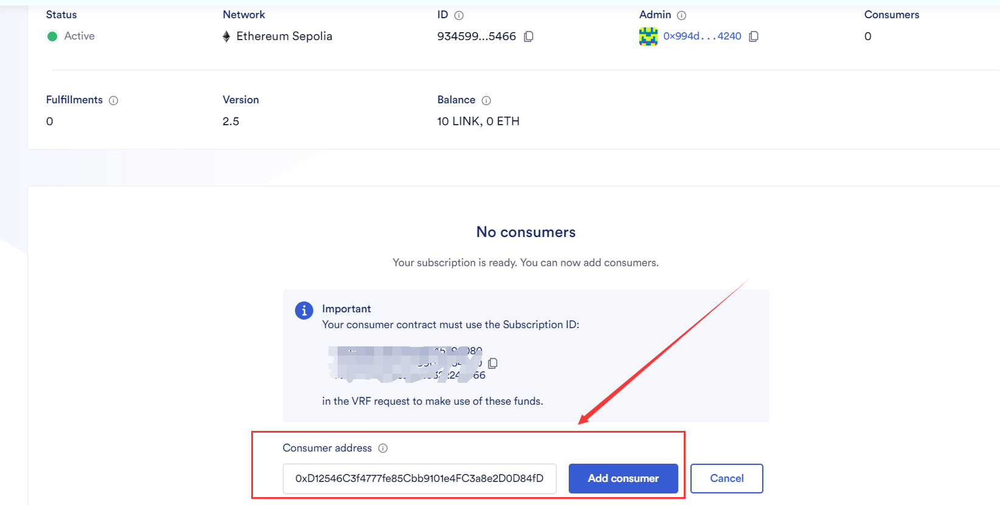

- step5：获取随机数并验证

    - 执行请求指令：

    ```shell
    cast send 0xD12546C3f4777fe85Cbb9101e4FC3a8e2D0D84fD "requestRandomWrods(by" tes32,uint256,uint16,uint32,uint32)" 0x787d74caea10b2b357790d5b5247c2f63d1d91572a9846f780606e4d953677ae 9345996778540633145599080787286650640079903515402078432104978623655322245466 3 300000 5 --rpc-url $env:s_rpc --private-key $env:s_pk 
    ```

    - 等待一段时间

    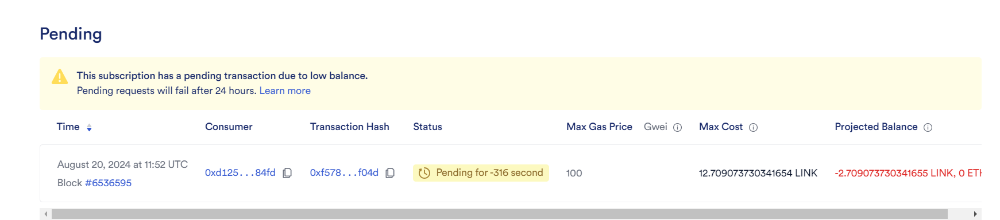

    - 查看随机数

    ```shell
    cast call 0xD12546C3f4777fe85Cbb9101e4FC3a8e2D0D84fD "getRandomWrods()" --rpc-url $env:s_rpc --private-key $env:s_pk
    ```

    

    成功获取五个随机数，长度都是`uint256`类型的，如果不需要这么长，可以在实际开发中按需取模等。

#### Effect

通过链下预言机获取随机数可以防止被作恶矿工控制随机数，这也是 solidity CTF中一种常见的题型，用户可以通过控制`block.timestamp`，`block.difficulty`等区块信息从而达到控制随机数的效果。

### 0x03 Automation

#### Principle

**合约自动化执行：** 顾名思义，合约自动化执行。比如：当某个代币的价格达到某个指定的值或者区间的时候，合约会自动执行买入或者卖出的操作。

- **手动DevOp&中心化服务器  和 Bounty模式**

    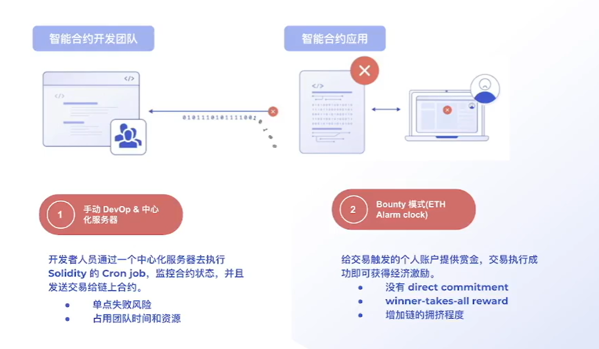

    这两种方式都存在一定的风险。

- **Chainlink Automation**

	**业务流程**
	
	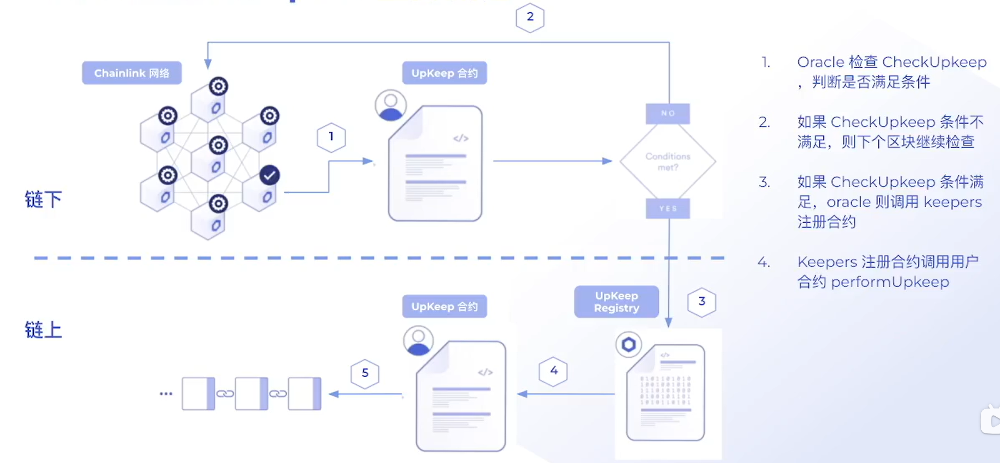
	
	- 用户编写 `upkeep`合约，并注册到`chainlink`中；
	
	- 预言机会在每个区块中检查 `CheckUpkeep`，判断是否满足条件；
	
	- 如果`CheckUpkeep`条件不满足，则下一个区块继续检查；
	
	- 如果`CheckUpkeep`条件满足了，预言机则调用 `keepers`注册合约；
	
	- `keepers`注册合约调用用户合约`perfomUpkeep`。
	
	  
	
	**技术架构**
	
	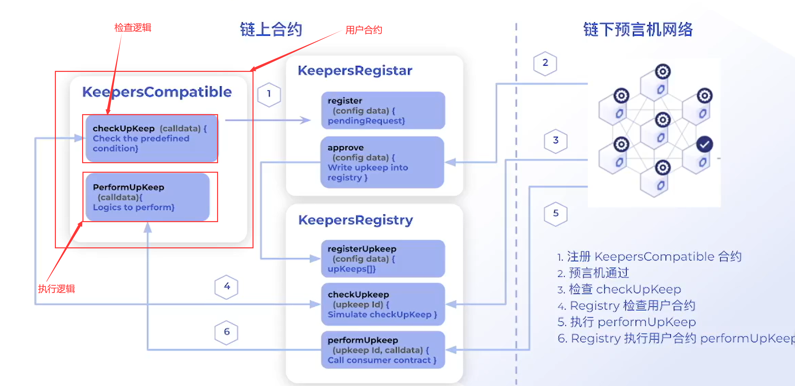
	
	*注：`CheckUpkeep`是在链下预言机完成的，可以节省gas费。*
	
	**使用场景**
	
	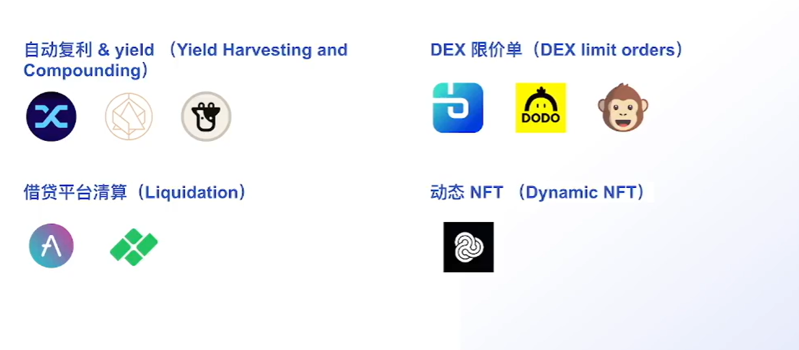	

#### Reproduction

**Tools:** Foundry

**Env：** Sepolia

**Data Source:**  https://automation.chain.link/

**需求**

- 假设有一个空投合约，当空投合约所有者将获胜者设置为`“我”`的时候，合约将自动领取
- 空投合约自定义，奖励为100个Token

**steps**

- step1：编写智能合约，并部署到 `sepolia`测试网上

    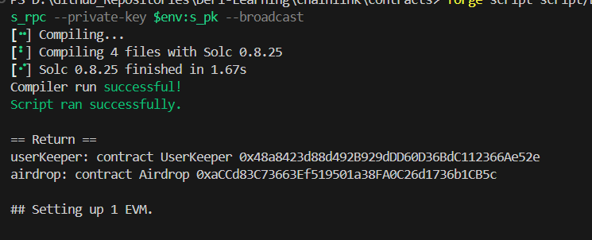

- step2：注册合约地址

    - 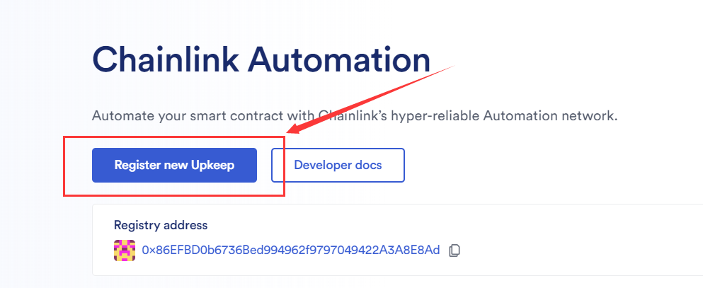

    - 
    - 
    - 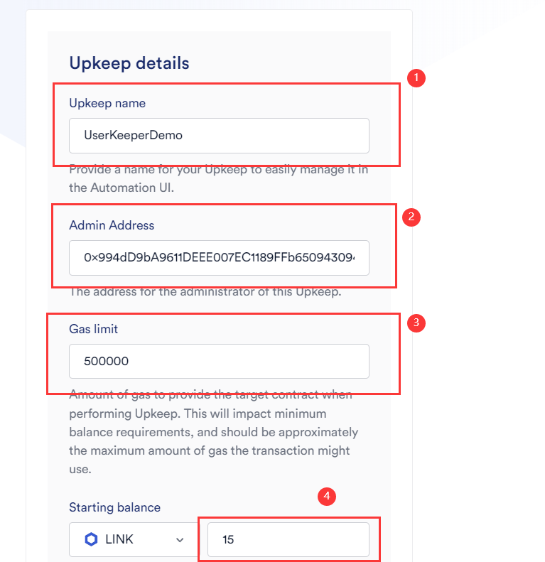
    - 
    - 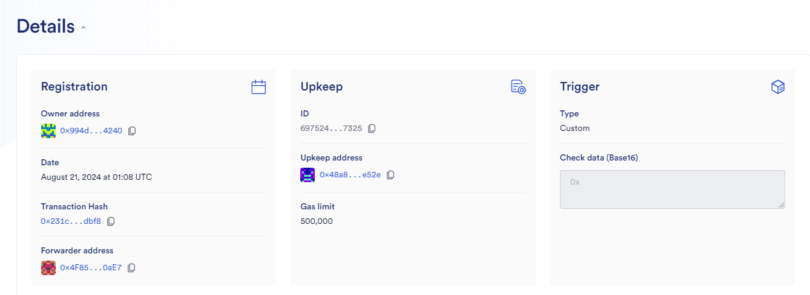
    
- step3：测试功能

    - 先查看`UserKeeper`合约是否获奖

        ```shell
         cast call 0xaCCd83C73663Ef519501a38FA0C26d1736b1CB5c "rewards(address)" 0x48a8423d88d492B929dDD60D36BdC112366Ae52e --rpc-url $env:s_rpc --private-key $env:s_pk
         
        # output=> 0x0000000000000000000000000000000000000000000000000000000000000000
        ```

    - 设置`Airdrop`合约中的获奖者

        ```shell
        cast send 0xaCCd83C73663Ef519501a38FA0C26d1736b1CB5c "setWinner(address)" 0x48a8423d88d492B929dDD60D36BdC112366Ae52e --rpc-url $env:s_rpc --private-key $env:s_pk
        ```

        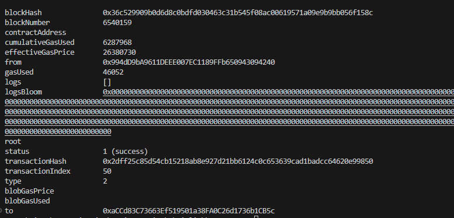

    - 再次查看`UserKeeper`合约是否获奖

        

        可以看到，此时`UserKeeper`已获奖【100】，再去`Chainlink`中查看操作记录

        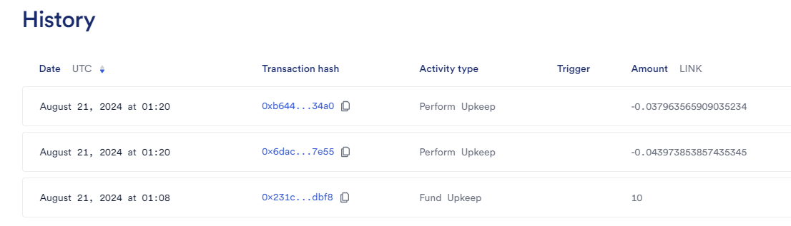
        
    - 测试合约
    
    ```solidity
    // SPDX-License-Identifier: MIT
    pragma solidity ^0.8.20;
    
    import {AutomationCompatibleInterface} from "@chainlink/contracts/src/v0.8/automation/interfaces/AutomationCompatibleInterface.sol";
    
    // contract address => 0x48a8423d88d492B929dDD60D36BdC112366Ae52e
    contract UserKeeper is AutomationCompatibleInterface {
        Airdrop public airdrop;
    
        constructor() {
            airdrop = new Airdrop();
        }
    
        function checkUpkeep(
            bytes calldata
        )
            external
            view
            override
            returns (bool upkeepNeeded, bytes memory performData)
        {
            if (airdrop.winner() == address(this)) {
                return (true, "");
            }
        }
    
        function performUpkeep(bytes calldata) external override {
            airdrop.airdrop();
        }
    }
    
    // contract address => 0xaCCd83C73663Ef519501a38FA0C26d1736b1CB5c
    contract Airdrop {
        mapping(address => uint256) public rewards;
        address public owner;
        address public winner;
    
        constructor() {
            owner = tx.origin; // there is a risk
        }
    
        modifier onlyOwner() {
            require(msg.sender == owner);
            _;
        }
    
        function setWinner(address _winner) external onlyOwner {
            winner = _winner;
        }
    
        function airdrop() external {
            require(msg.sender == winner, "You are not the winner.");
            rewards[msg.sender] = 100;
        }
    }
    ```
    
    - 部署合约
    
    ```solidity
    // SPDX-License-Identifier: MIT
    pragma solidity ^0.8.20;
    
    import {Script} from "forge-std/Script.sol";
    import {UserKeeper, Airdrop} from "../src/Automation.sol";
    
    contract DeployAutomation is Script {
        function run() external returns (UserKeeper userKeeper, Airdrop airdrop) {
            vm.startBroadcast();
            userKeeper = new UserKeeper();
            airdrop = userKeeper.airdrop();
            vm.stopBroadcast();
        }
    }
    ```
