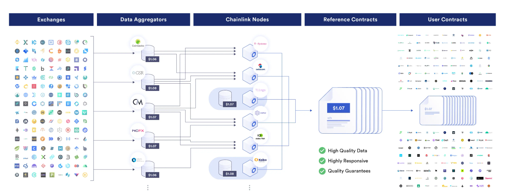

### 0x00 Introduction

> 区块链就像黑匣子一样是完全封闭的，无法与外部世界连通，智能合约本身也无法连接链下数据。对于现实世界中的例如：天气，比赛分数以及航班信息等都无法获取，这也是智能合约最大的痛点，极大程度上限制了智能合约开发者的创造力，那么有什么办法可以解决吗？
>
> 答：当然是有的，预言机则充当这类角色，负责上传现实世界中的真实数据到智能合约。
>
> **预言机分为中心化预言机和去中心化预言机。**
>
> **工作流程**
>
> 
>
> ***中心化预言机***
>
> 负责上传现实世界的真实数据到智能合约的一个数据源，但是由于中心化的缘故，中心化预言机中不仅存在单点失败风险，而且还存在数据不安全风险，这又变相削弱了智能合约安全性的特性。
>
> ***去中心化预言机***
>
> 多个数据节点形成去中心预言机，每个节点都会收集数据，达成共识后输入到区块链的智能合约。而`chainlink`便是其中的一种。
>
> - 技术上：避免了单点失败风险。
> - 数据上：通过网络对多个数据源进行验证。
>
> `chainlink`提供了Data Feed，VRF，Automation 等功能，目前采用的共识机制是取中位数。

### 0x01 Data Feed

#### Principle

**业务流程**

- 数据提供商：负责收集价格数据，将价格数据提供给预言机。
- 预言机节点：获得数据之后和预言机中的其他节点达成共识，随后将共识后的数据发送到`chainlink`部署到区块链中的智能合约，最后用户可以通过部署在区块链的智能合约获取到相应的价格数据。

**技术架构**

采用代理模式，便于合约的升级。

使用流程如图所示：

#### Reproduction

