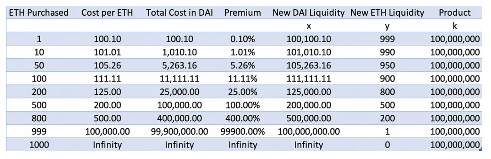

## 深入解读 Uniswap V2 白皮书

### 引言

本文主要记录我个人对 uniswap v2 白皮书的解读，水平有限难免有错误之处，欢迎斧正。

旨在深入理解其中的数学原理，从而帮助进一步理解 代码的实现。

文章按照白皮书的目录进行解读，其中会加入一些个人的理解和思考。

### Uniswap-V2 Core

#### 1.  Introduction

### 文章延伸

#### swap导致价格波动的原因

UNISWAP 围绕着 `x * y = k` 这个恒定乘积执行代币的`swap`操作。
$$
x * y = k  \tag{恒定乘积AMM}
$$

$$
假设 TokenA 数量为 x_0， TokenB 数量为y_0，且交易池中具有一定的流动性。
\\
如果 userA 使用 {\Delta x} 数量 的 TokenA 去兑换 TokenB，有
\\
y'_1 = \frac {k} {x_0 + \Delta x} \tag{1}
$$
$$
如果 userB 使用 {\Delta x} 数量 的 TokenA 去兑换 TokenB，有
\\
y'_2 = \frac {k} {x_0 + \Delta x + \Delta x} \tag{2}
$$

$$
不难看出 y'_2的值肯定是要比y'_1的值要小的，从而反映出 TokenB的价格升高了。
$$

这是因为 TokenA 的数量变多了，即使 userB 和 userA 的 TokenA 数量相同，那么后来者的 TokenA 将会对池子中TokenA的数量影响将会被削弱，即池子TokenA的数量将不会受到同样大幅度的影响。

举个例子，假如ETH/DAI池子中的资金为：ETH(100):DAI(10000)，K = 100 * 10000 = 1e6。
$$
state_0: K = 1e6, ETH=100, DAI=10000
\\
\\
假设userA使用10个ETH兑换DAI,有
\\
y'_1 = \frac {k} {x_0 + \Delta x} = \frac {1e6} {100 + 10} \approx 9090.9
\\
\Delta y_1 = y_0 - y'_1 = 10000 - 9090.9 = 909.1 DAI

\\
\\
state_1: K = 1e6, ETH=110, DAI=9090.9
\\
\\
假设userB也使用10个ETH兑换DAI,有
\\
y'_2 = \frac {k} {x_1 + \Delta x} = \frac {1e6} {110 + 10} \approx 8333.3
\\
\Delta y_2 = y_0 - y'_2 = 9090.9 - 8333.3 = 757.6 DAI

\\
\\
state_2: K = 1e6, ETH=120, DAI=8333.3
\\
\\
userB也是使用10 ETH兑换 DAI，换出来的DAI要少于userA兑换的DAI，说明TokenB的价格变高了。
$$
TokenA 和 TokenB 在池中的数量变换关系为：

